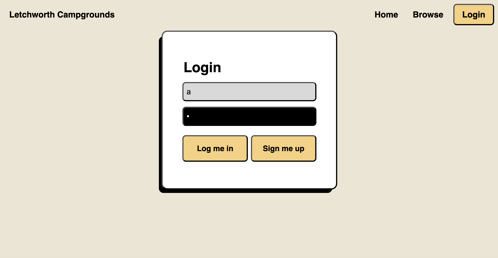
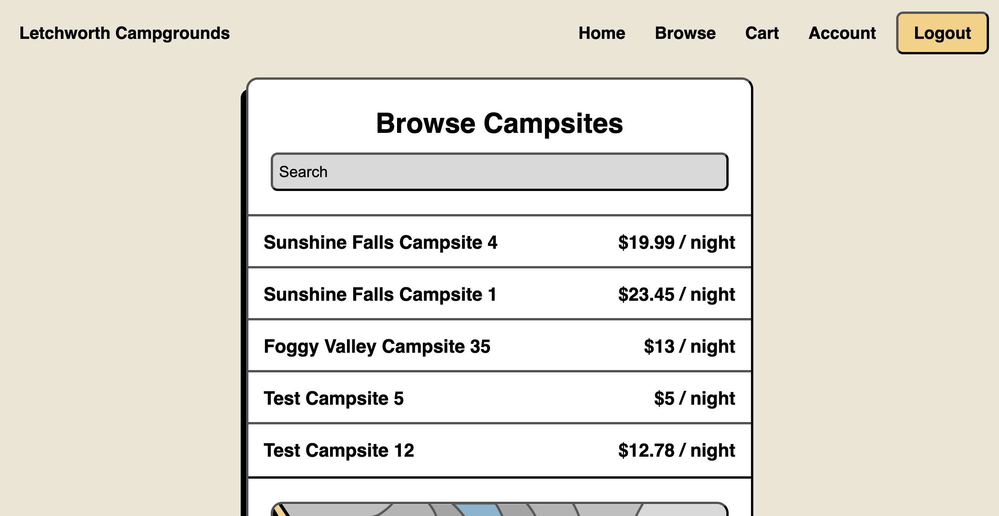
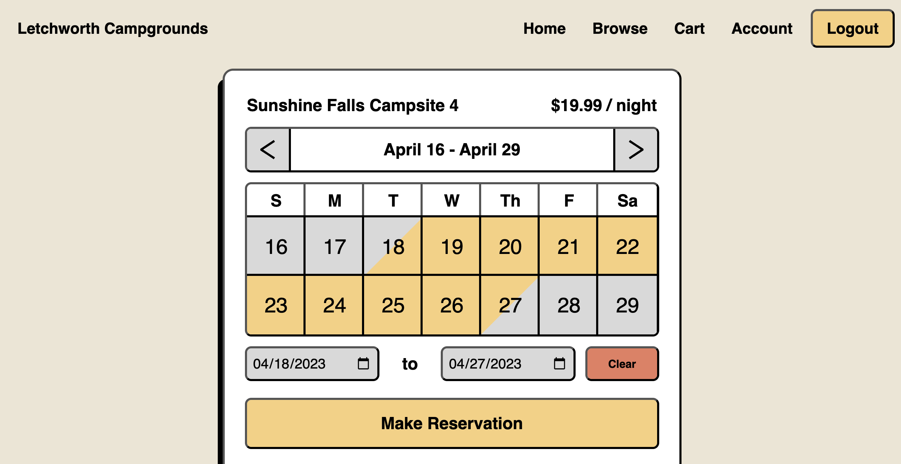
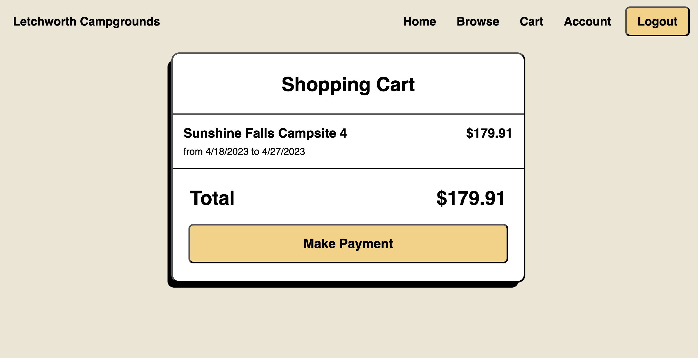

# E-Store: Letchworth Campgrounds E-store

An online E-store system built in Java 17 
  

  
## Team

- Michael Oldziej
- Kolbe Yang
- Sherry Robinson
- Lianna Pottgen 
- Troy Wolf

## Prerequisites

- Java 17 (Make sure to have correct JAVA_HOME setup in your environment)
- Maven
- Angular CLI
- npm

## How to run it

1. Clone the repository and go to the root directory.
2. Go to estore-api directory
3. Execute `mvn compile exec:java`
4. Go to E-store-Angular directory
5. Run 'npm install' and then 'npm start'
6. Open in your browser `http://localhost:4200/`

User Login

Browse Campsites

Make Reservation, select dates

Checkout, purchase reservations

See existing reservations

## Known bugs and disclaimers
-when updating the location of a campsite on the map, the map displays both the temporary location and the existing location

## How to test it

Run 'mvn clean test' from the estore-api directory
hooks for run unit tests and generate code coverage
reports in HTML.

To run tests on all tiers together do this:

1. Execute `mvn clean test jacoco:report`
2. Open in your browser the file at `PROJECT_API_HOME/target/site/jacoco/index.html`

To run tests on a single tier do this:

1. Execute `mvn clean test-compile surefire:test@tier jacoco:report@tier` where `tier` is one of `controller`, `model`, `persistence`
2. Open in your browser the file at `PROJECT_API_HOME/target/site/jacoco/{controller, model, persistence}/index.html`

To run tests on all the tiers in isolation do this:

1. Execute `mvn exec:exec@tests-and-coverage`
2. To view the Controller tier tests open in your browser the file at `PROJECT_API_HOME/target/site/jacoco/model/index.html`
3. To view the Model tier tests open in your browser the file at `PROJECT_API_HOME/target/site/jacoco/model/index.html`
4. To view the Persistence tier tests open in your browser the file at `PROJECT_API_HOME/target/site/jacoco/model/index.html`

*(Consider using `mvn clean verify` to attest you have reached the target threshold for coverage)
  
  
## How to generate the Design documentation PDF

1. Access the `PROJECT_DOCS_HOME/` directory
2. Execute `mvn exec:exec@docs`
3. The generated PDF will be in `PROJECT_DOCS_HOME/` directory

## License

MIT License

See LICENSE for details.
