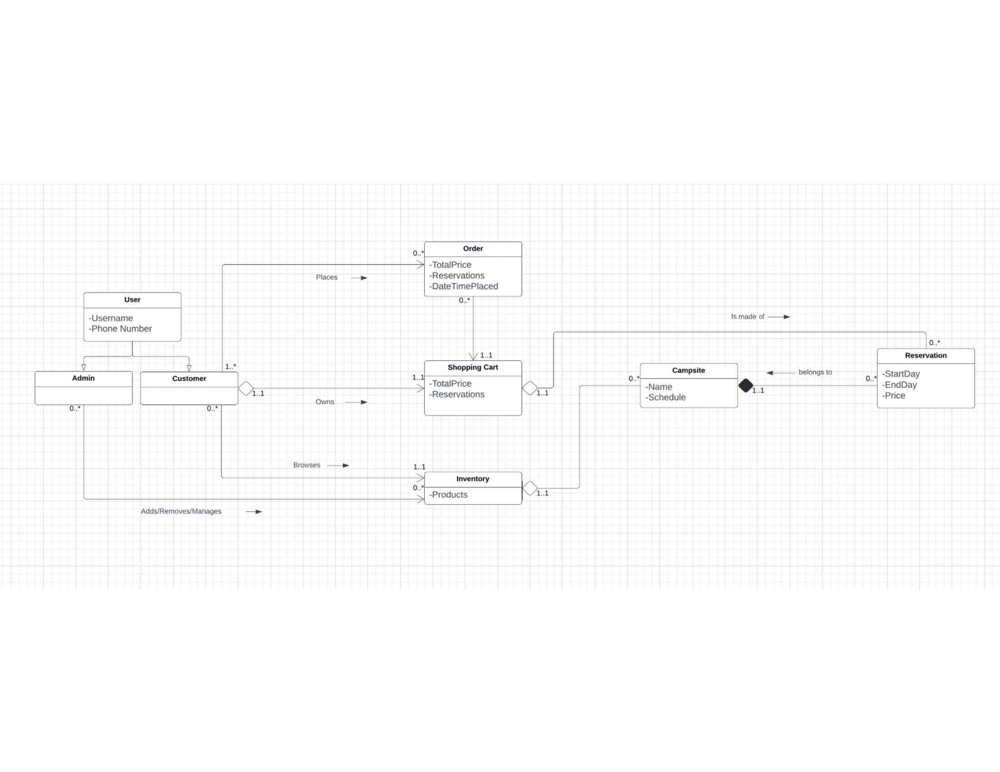
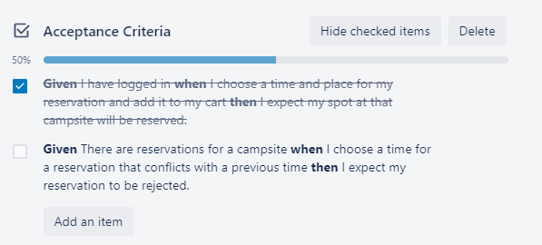
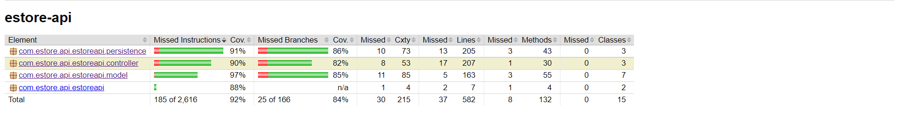

# PROJECT Design Documentation

## Team Information
* Team name: Fantastic Five
* Team members
  * Michael Oldziej
  * Kolbe Yang
  * Troy Wolf
  * Sherry Robinson
  * Lianna Pottgen
## Executive Summary

This is a summary of the project.

### Purpose

The goal of the Letch Worth E-store was to provide the Letch Worth Campgrounds company with the ability to rent out their campsites to customers through a online service. In the most basic level the E-store would be able to let users log online to browse through and reserve campsites that were made available by the company owner. 

### Glossary and Acronyms

| Term | Definition |
|------|------------|
| SPA  | Single Page Application |
| API | Application programming   interface
| CRUD | Create Read Update Delete|
| START | START or Representational State Transfer   is the architectural style that was used   for the project's separate components.
| SPA | Single Page Application
| UI  | User Interface
| UML | Universal Markup Language
| Spring Framework | The platform used to develop   the project software
| TDD | Test Driven Development

## Requirements

This section describes the features of the application.

### Definition of MVP
The E-store for Letchworth Campgrounds handles the reservations for various campsites offered by the company. The e-store owner can login and obtain admin privileges such as being able to add, remove, and edit the campsites on the inventory which includes their names, rates, and current availability (able to be reserved or not). Customers sign up and login with their credentials. Once logged in, customers can see a list of campsites and search for a specific campsite under the home page. Customers can also create a reservation at a specific campsite and have it added to their cart, remove a reservation from their cart, and purchase all reservations currently in their cart. Once purchased, the customer can see the reservations under the Reservations page and be able to cancel them. 
Each campsite can only have one reservation at any given time, so if a user makes a reservation at one campsite, another user cannot make an overlapping reservation at the same campsite. The reservations in the customers shopping cart remain even after logging out, and once a reservation is in a shopping cart, it is considered a part of the schedule of that campsite and no other user will be able to make a reservation at that campsite that overlaps.

### MVP Features
STORY
  Login: As an owner, I can login with the username “Admin” and the password “1234” so that I can receive administrator privileges.
 EPIC
 Edit Inventory: As an owner, I want to edit the campsites listed in the inventory so that the list of campsites displayed  to the customers is accurate and up to date.
 STORY
 Add Campsite: As an owner, I want to add a new campsite to the inventory so that it will be displayed to the customers.
 STORY
 Remove Campsite: As an owner, I want to remove campsites from the inventory so that it will no longer be displayed in the e-store.
 STORY
 Create Account: As a customer, I want to create an account so I can login to the e-store.
 Login: As a customer, I want to login with my credentials so that I can access the e-store and make reservations.
 STORY
 Create Reservation: As a customer, I can select a campsite and enter the dates for my reservation so that my reservation will be added to my cart and my spot and time will be reserved.
 STORY
 Remove Reservation from Cart: As a customer, I can remove a campsite from my cart so that when I decide I don’t want the reservation I don’t have to pay for it when I checkout.
 STORY
 Checkout: As a customer, I can checkout and purchase all reservations in my cart so that my reservations will be confirmed.
 STORY
 Cancel Reservation: As a customer, I can cancel a reservation I have paid for so that my spot at that campsite is no longer reserved.
 STORY
 Search for a Campsite: As a customer, I can search for campsites with names similar to what I search for so that I can find a specific campsite without having to browse the entire inventory.
 STORY
 Browse Campsites: As a customer, I can browse through all listed campsites so that I can choose one to make a reservation at.

### Roadmap of Enhancements
 Scheduling: Campsites will not be able to have more than a specified amount of reservations at any given time.
 Changes in inventory: If the owner removes a campsite from the inventory or changes its status to not reservable, any customers with paid reservations or reservations in their cart for that campsite will receive a notice and their reservations will be removed the next time they login. 
 Setting Campsite Dates: The owner will be able to specify certain times of year that the campsites are available or unavailable and users will be able to see this.

## Application Domain

This section describes the application domain.

Our overall Domain Model is a representation of the classes and proper dictation we have used throughout our project. Our Domain Model goes through the entire relation of classes as we move through all of the attributes that our project has. In order to properly explain each step of our domain model I will go class by class to explain the proper relationships and attributes behind each class. 
	  To begin, we start with the User class. The User class will define who exactly is logging into our application. There are two subclasses for this, an Admin who will have special privileges within the application and the Customer who will have limited access to the website data. The User class will hold the username and password attribute. In our case, if the user is a customer we might have something like User user = new User(bat, man, false), so this user will have username bat, password man, and is not an admin. This User class will handle all exceptions. It will be able to see the attributes of both the admin and customer class, but no classes can see any user methods. The user class holds the admin and customer class as subclasses.
Next, we will discuss the Admin class. The Admin class is a class that will be able to communicate with the Inventory class in order to remove, add, or manage products for however many times that they need or want to. The Admin class is a subclass of the User class but it cannot see the attributes or methods of the User class. Overall, this Admin class will maintain the properties of what an Admin User can do. Since the Admin class is simply a subclass of the User class, it simply inherits some simple methods like perhaps getUsername(), getPassword(), getIsAdmin(), etc…
    Next, we will discuss the Customer class. The Customer class is a subclass of the user class and is able to view the data of the Inventory class. The Customer class can interact with the Order class and have 1 to infinity orders. The Customer class can interact with the inventory by browsing a selection. The Shopping cart class is strongly dependent on the Customer class since every customer will have a shopping cart in initiation based on the username. 
Next, we have the Order class. The Customer can see the order class and will be able to hold Order class information. The Order class is really only affected when the User orders something new. The Order class will contain the total price of everything in that order, the reservation data, and the data and time that the order was paid for and went through. The Customer can create 1 to infinity orders since each time they want to pay for a cart set that paid order will be put into their order list. So the Order class will be able to access the basic data from the Customer, for example username, and the Customer will be able to access all of the Order data that they would need. 
    Next, we have the Shopping cart class. The shopping cart will hold the total price value that will hold the entire cart price, and will hold the reservations. Since the Shopping cart is only one per user and is saved based on the username of the Customer, there will only be one shopping cart per user. This class will be strongly reliable on the Customer class since without the Customer, there is no shopping cart. The Shopping cart will be able to hold unlimited amounts of reservations so this class can see and interact with the Reservation class and have 0 to infinity reservations.
The Inventory cart class will have access to all of the possible reservations we can have for each campsite. Since our inventory is reservation based, it needs to hold all of the possible reservation time slots for each campsite. The Inventory class is seen by both the Customer and the Admin. It is editable by the Admin and is only viewable by the Customer. The Admin is able to access and add an unlimited amount of items in the inventory so the relationship is editable and infinite. The User is only able to view the one inventory set of data so its relationship is viewable finite, 1. 
    Moving onto the Campsite class. Inventory is strongly reliant on the campsites class which is why there is aggregation between the Inventory and the campsites. The inventory is able to hold 0 to infinite campsites, but the campsites can only be a part of one inventory since there is only one inventory to hold every product/reservation.The campsite will need to base its availability on the reservation class. Because of this, all reservations are really strongly reliable on the Campsite class and could not function at all without it. As stated previously, this Campsite will be used in the inventory classe, but since there is only one inventory it can only access 1. 
Finally, the Reservation class. The Reservation class is pretty much the total package of our product. It will hold the startDay, endDay, Price, and when constructed will also hold what campsite it is associated with and the username of who placed the reservation. This class will be strongly associated with the campsites. Without the campsite there would be nothing to reserve so the campsite class must function properly in order for the reservations to function. There can only be one campsite per reservation but there can be infinitely many reservations per campsite. The Reservation class and the Campsite class can see each other since they must access the available and current reservations for each new order. 
    Overall, our domain model shows the general movement of how we process, store, and relate data in our application. 

## Architecture and Design

This section describes the application architecture.

### Summary

The following Tiers/Layers model shows a high-level view of the webapp's architecture.

The e-store web application, is built using the Model–View–ViewModel (MVVM) architecture pattern. 

The Model stores the application data objects including any functionality to provide persistance. 

The View is the client-side SPA built with Angular utilizing HTML, CSS and TypeScript. The ViewModel provides RESTful APIs to the client (View) as well as any logic required to manipulate the data objects from the Model.

Both the ViewModel and Model are built using Java and Spring Framework. Details of the components within these tiers are supplied below.

### Overview of User Interface

This section describes the web interface flow; this is how the user views and interacts
with the e-store application.

- From the home page, a user will click the login button
- The user can browse all the campsites on the home page
- The user can also use the search bar to search for a specific campsite
- The user can input a start date nad end date to create a campsite reservation
- The user can click the make reservation button to add their reservation to their shopping cart
- The user can click cart to see all of their unpurchased reservations
- The user can click make payment to purchase the reservations in their carc
- The user can click reservations to see their purchased reservations

### View Tier

app.component
- displays the top navigation bar
- displays certain buttons based on whether a user is logged in or not

app-routing.module
- when navigation buttons are clicked, this routes the user to selected pages

user-login.component
- takes username and password input
- displays errors for invalid input
- uses the login.service to make login and signup requests to the api

login.service
- makes login and signup requests to the api
- stores the information of the user that is logged in

product-detail.component
- displays all the campsites
- uses the product.service to send requests to the api
- allows Admin to edit and delete campsites
- allows customers to create reservations for any campsites
- initial input checking for bad reservation start dates and end dates
- allows users to search for a specific campsite

product.service
- sends requests to the api to create, delete, update, and get campsites

view-cart.component
- Uses the login.service to get all unpurchased reservations for the logged-in user
- allows the user to purchase the reservations in their cart
- allows the user to delete reservations from their cart

view-reservations.component
- Uses the logi.service to get all purchased reservations for the logged-in user
- allows the user to delete reservations that they've purchased

reservation.service
- sends requests to the api to create, delete, update, and get reservations

### ViewModel Tier
InventoryController
- creates, updates, gets, deletes campsites
- gets campsites based on a search query
- can get all reservations of a specific campsite

UserController
- creates, updates, gets, deletes users
- can get all reservations of a specific user

ReservationController
- creates, updates, gets, deletes reservations

ScheduleService
- makes sure reservations do not overlap

AuthenticationService
- generates session tokens for all users when they log in
- checks to see if psaswords from the UI match stored passwords

### Model Tier
Classes
  - Authentication Service:
    * Its primary responsibility is to generate, contain, and verify user tokens
    * Uses private methods to generate a new token value, and generate a token for a specified user
    * This class can be used to login a user, determine user login status, whether they are a valid user, and whether a token is associated with an admin or customer  

  - Campsite:
    * Its primary responsibility is to create new campsites, along with managing/editing campsites
    * Declares the campsite's fields (id, name, rate) as JsonProperties
    * This class can compare campsite objects based on their names, get campsite field values, and set field values
    * Throws exceptions for when invalid values are entered 

  - Login Request:
    * Its primary responsibility is to represent a Login request
    * Declares Login request fields (username, password) as Json Properties
    * The only methods this class uses are to return a Login Request's username, and its password

  - Login Response:
    * Its primary responsibility is to represent a Login response
    * Declares Login request fields (username, password, isadmin) as Json Properties
    * The only methods this class uses are to return a Login Request's username, its password, and admin status

  - Reservation:
    * Its primary responsibility is to create a new reservation object, along with managing/editing reservations, associated with a campsite object
    * Declares the reservation's fields (id, campsiteId, startDate, endDate, username, paid, price) as Json Properties
    * Has getters and setters for the fields as deemed necessary
    * Can determine if reservations are the same  

  - Schedule Service:
    * Its primary responsibility is to create reservations using the information in reservation object, along with determining if they are valid reservations
    * Reservations are determined to be valid by being associated with a valid campsite, and by having valid start and end dates

  - User:
    * Its primary responsibility is to create new users, along with determining if users are the same
    * Decalres the user's fields (username, password, isAdmin) as Json Properties
    * Uses an equals methods that determines is useres are equal by checking usernames, can promote users to admin, get user fields, and authenticate passwords. 

  - InventoryDAO:
    * Its primary responsibility is to serve as an interface for the InventoryFileDAO
    * The interface declares methods for getting campsites, creating campsites, updating campsites, deleting campsites, getting all campsites, and finding specific campsites given a certain criteria

  - InventoryFileDAO:
    * Its primary responsibility is to serve as the object to get Inventory data regarding campsites
    * Implements the methods described in the InventoryDAO interface, interacts with campsite json file, and updates the Campsite Json data accordingly

  - ReservationDAO:
    * Its primary responsibility is to serve as an interface for the ReservationFileDAO
    * The interface declares methods for getting reservations, get a users specific reservations, get Cart Total, create reservation, update reservations, pay a reservation, pay for a shopping cart, and delete reservations

  - ReservationFileDAO:
    * Its primary responsibility is to serve as the object to get Inventory data regarding reservations
    *Implements the methods described in the ReservationDAO interface, interacts with reservation json file, and updates the Campsite Json data accordingly

  - UserDAO:
    * Its primary responsibility is to serve as an interface for the UserFileDAO
    * The interface declares methods for getting all users, getting a specific user, determining if a user exists, create a user, update a user, and delete a user

  - UserFileDAO:
    * Its primary responsibility is to serve as the object to get data regarding users
    * Implements the methods described in the UserDAO interface, interacts with userjson file, and updates the Campsite Json data accordingly

### Static Code Analysis/Design Improvements

## Testing

### Acceptance Testing

For the acceptance portion of the code, almost all of the user stories have passed their acceptance criteria.  In total, 10 of the 11 user stories completed passed all of their acceptance testing. However, there were two user stories that did not pass the acceptance testing. The first story that didn't pass all of its tests was the story: Buyer, Add Reservation to Cart. Its Acceptance Criteria are shown below:

As it can seen be the second criteria of preventing scheduling conflicts was not completed. This is due to the campsites not checking for overlapping times for reservations, but this will be fixed in later versions of the project.  In total the rest of the acceptance testing of the user stories were tested and verified.

### Unit Testing and Code Coverage

The strategy that was used for unit testing was to first have a developer fully implement the backend classes for a specific feature they were working on. After this was done, a separate user created the required Unit tests of the project using the Junit and Mockito testing frameworks. These unit tests were subdivided based on the three main components of the project: the model, controller, and the persistence.  

After all the tests passed, a Jacoco report was generated to check the coverage of the testing. This was used to determine what other test cases/scenarios need to be covered. The figure below shows the results of the Jacoco report. 

As it can be seen the code coverage 97% was achieved for the persistence, 91% was achieved for the model, and 90% was achieved for the controller. The coverage targets that were aimed for were 90% for the controller and persistence, and 95% for the model.  Although all of the coverage targets were achieved, there were still some untested scenarios that will need to be addressed later on.  For some classes in the model it made more sense to follow Test Driven Development (TDD) and have tests the fail until methods are implemented, but for the remaining classes in the other tiers it wasn't as feasible. Overall, as the project continues, the unit testing will be continually updated to ensure that the code is functioning.
